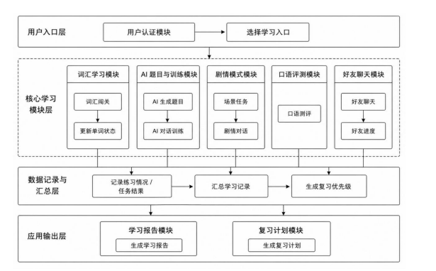
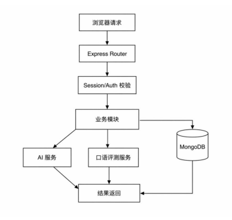

<div align="center">

# 🌟 WordWise (enPromote)
### 基于大模型与语音评测引擎的下一代沉浸式英语学习平台
**Next-Gen AI-Powered Immersive English Learning & Oral Assessment Platform**

[](https://vuejs.org/) [](https://www.typescriptlang.org/) [](https://vitejs.dev/) [](https://nodejs.org/) [](https://expressjs.com/) [](https://www.mongodb.com/) 
[](https://deepseek.com/)  [](https://www.xfyun.cn/) [](LICENSE)

<p align="center">
  <b>让背单词不再枯燥，用真实语境与 AI 交互重构语言学习全链路</b>
  <br />
  从「机械识记」到「场景闯关」，从「不敢开口」到「AI 实战对话 & 智能口语发音评测」
</p>

[✨ 核心特性](#-核心特性) •
[🕹️ 学习结构与玩法](#️-学习结构与玩法) •
[🏗️ 系统架构与技术栈](#️-系统架构与技术栈) •
[🚀 快速启动](#-快速启动) •
[⚙️ 环境变量配置](#️-环境变量配置) •
[🗺️ 路线图](#️-产品演进与路线图-roadmap)

---

</div>

## 📖 项目简介

**WordWise (enPromote)** 是一款专为中文母语学习者打造的**多维沉浸式英语学习平台**。

传统学习工具往往将“背单词”与“真实应用”割裂，学习者即使背完几千词，在实际交流中依然“听不懂、拼不出、不敢说”。WordWise 打破了这种孤岛模式，创新性地提出 **「5关递进微循环 + 沉浸式角色剧情 + 实时AI智能口语评测 + 数据化成长复盘」** 的完整闭环，让每一次练习都发生在真实的生活与职场情境中。

---

## ✨ 核心特性

| 模块 | 核心亮点 | 带来价值 |
| :--- | :--- | :--- |
| 🎯 **5步场景闯关** | 词汇初识 ➔ 拼写肌肉记忆 ➔ 纯听力辨音 ➔ AI自适应出题 ➔ 目标词实战会话 | 单个场景 10-15 分钟闭环，拒绝学完就忘 |
| 🎭 **沉浸式角色剧情** | 故事驱动的支线剧情任务，融合多轮对话、交互拼写、听力理解与剧本抉择 | 游戏化体验，如同玩 RPG 般在剧情中自然运用英语 |
| 🎙️ **AI 口语智能测评** | 接入**科大讯飞语音评测 (ISE)** 引擎，支持流式录音、音素级/重音诊断与纠音建议 | 告别哑巴英语，毫秒级反馈流利度、完整度与发音分 |
| 🤖 **自适应大模型驱动** | 基于 DeepSeek / 阿里百炼 DashScope，动态根据用户遗忘点出题，并扮演真实 NPC 对话 | 千人千面的练习题目与生动有趣的实战拟真陪练 |
| 📊 **科学复盘与记忆曲线** | 艾宾浩斯记忆模型排程、闪卡（FlashCard）复习、雷达能力诊断与每日学习报告 | 学习进度与弱项一目了然，用数据驱动自律 |
| 👥 **社交激励与学习圈** | 好友申请/接受、学习排行榜、好友能力雷达对比与即时交流 | 告别单打独斗，在良性竞争与互动中持续坚持 |

---

## 🕹️ 学习结构与玩法

WordWise 围绕两条核心主线展开：**「闯关体系」** 与 **「AI 口语测评」**。
<p align="center">
  
</p>

### 1. 关卡式场景闯关（固定 5 关递进）
* **关卡 1：词汇学习 (Vocabulary Learning)**
  * 真实场景（机场、酒店、面试、点餐等）高频词汇精讲；
  * 提供纯正发音音频、词性分析与场景例句。
* **关卡 2：拼写练习 (Spelling Practice)**
  * 针对目标词进行键盘键入盲拼训练，强化词根音形对应与拼写准确度。
* **关卡 3：听力训练 (Listening Training)**
  * 遮蔽文本干扰，通过纯音频辨析选词与填空，专治“看得懂却听不懂”。
* **关卡 4：AI 动态题目 (AI-Generated Adaptive Questions)**
  * LLM 结合用户前 3 关的掌握情况与易错词，实时生成单选、语境填空等定制化自适应测试题。
* **关卡 5：实战对话 (Scenario AI Roleplay & Task Chat)**
  * AI 化身为特定场景 NPC（如前台接待、海关官员），设定明确沟通目标；
  * **机制规则**：用户需在对话中灵活且正确地调用本关的目标单词，AI 会即时校验任务完成度并给予对话复盘。

### 2. 角色剧情模式 (Story Mode)
* 区别于单元式的 5 关训练，剧情模式将语言学习融入跌宕起伏的互动式故事线；
* 每一个章节由**剧情对话、线索拼写、听力捕获、情节阅读**等任务组成，通关即可解锁故事后续与隐藏分支。

### 3. AI 口语测评 (Oral Assessment)
* 支持**浏览器端麦克风实时高保真音频采集**（转换为 16bit / 16kHz 单声道 PCM 格式）；
* 深度集成**科大讯飞语音评测（ISE）大模型/WebSocket接口**，针对句式跟读提供包括声学发音、完整度、语速、重音在内的专业四维评分；
* 内置 **AI 口语教练（Oral Coach）**，针对发音薄弱点智能生成针对性纠音技巧；
* 配套完善的 **Mock ISE 模式**，无真实 Key 时仍可实现本地全流程丝滑调试。

---

## 🏗️ 系统架构与技术栈

### 技术栈全景

<p align="center">
  
</p>

---

## 📂 项目目录结构

```text
enPromote/
├── frontend/                     # Vue 3 前端现代工程
│   ├── src/
│   │   ├── api/                  # RESTful API 请求封装
│   │   ├── assets/css/           # 全局样式系统与变量
│   │   ├── components/           # 复用业务与 UI 组件 (听力/拼写/口语等)
│   │   │   ├── tasks/            # 剧情任务执行器组件
│   │   │   └── story/            # 故事模式相关组件
│   │   ├── composables/          # 组合式函数 (usePcmRecorder 录音等)
│   │   ├── router/               # 路由守卫与导航配置
│   │   ├── stores/               # Pinia 状态管理 (User, Chat, Friend)
│   │   ├── utils/                # 音频 PCM 转换、Toast、请求工具
│   │   └── views/                # 视图页面 (闯关、剧情、报告、社交)
│   ├── vite.config.ts            # Vite 构建与反向代理配置
│   └── package.json
│
├── server/                       # Node.js + Express 后端服务
│   ├── config/                   # 服务与数据库连接配置
│   ├── modules/                  # Mongoose 数据模型 (User, Word, Story 等)
│   ├── router/                   # 业务路由切片 (auth, word, oral, story 等)
│   ├── services/                 # 外部服务代理 (讯飞 ISE、DeepSeek、阿里百炼)
│   ├── utils/                    # 日志体系 (Winston)、统一缓存封装
│   ├── word/                     # 词库静态资源与初始化脚本
│   ├── app.js                    # 后端启动入口
│   └── package.json
│
├── docs/                         # 模块级详细设计与开发文档
│   ├── modules/                  # 闯关/单词/AI/口语/社交/报告模块说明
│   └── screenshots/              # 效果展示截图 (待补充)
├── .env.example                  # 环境变量配置模板
└── README.md                     # 项目主说明文档
```

---

## 🚀 快速启动

### 1. 环境准备
确保您的本地开发环境满足以下要求：
* **Node.js**: >= 18.0.0
* **MongoDB**: >= 6.0 (本地运行或云端实例)
* **包管理器**: npm (>= 9.0) 或 pnpm / yarn

---

### 2. 克隆与配置环境变量

```bash
# 1. 克隆代码仓库
git clone https://github.com/CCSU-HorizonLab/enPromote.git
cd enPromote

# 2. 复制后端环境变量文件
cp .env.example server/.env
# Windows PowerShell 请使用: copy .env.example server\.env
```

打开 `server/.env`，根据自身情况进行微调（若无第三方 Key，可直接使用默认的 Mock 模式启动）：

```ini
PORT=3000
HOST=localhost
DB_URL=mongodb://localhost:27017/EnglishMastery
SESSION_SECRET=your-secure-session-secret

# 大语言模型配置 (DeepSeek / OpenAI 兼容协议)
AI_BASE_URL=https://api.deepseek.com
AI_API_KEY=your_deepseek_api_key

# 阿里云百炼 (部分题目生成)
ALIYUN_BASE_URL=https://dashscope.aliyuncs.com
ALIYUN_API_KEY=your_dashscope_api_key

# 口语评测引擎配置 (支持讯飞或本地 Mock)
USE_MOCK_ISE=true               # 建议本地开发初期设为 true，无需申请讯飞账号
XUNFEI_APP_ID=your_xf_app_id
XUNFEI_API_KEY=your_xf_api_key
XUNFEI_API_SECRET=your_xf_api_secret
```

---

### 3. 安装依赖

```bash
# 安装服务端依赖
cd server
npm install

# 安装前端依赖
cd ../frontend
npm install
```

---

### 4. 启动服务

打开两个终端窗口分别运行：

#### 终端 1：启动后端服务
```bash
cd server
npm start
# 服务默认在 http://localhost:3000 启动
```

#### 终端 2：启动前端工程
```bash
cd frontend
npm run dev
# 前端默认在 http://localhost:5173 启动，并通过 Vite 自动代理 /api 到 3000 端口
```

打开浏览器访问 `http://localhost:5173`，即可体验完整的 WordWise 英语学习平台！

---

## 📦 生产部署建议

### 前端构建
```bash
cd frontend
npm run build
```
构建文件将输出到 `frontend/dist/`，可使用 Nginx、Vercel 或 Caddy 进行静态资源托管，并在 Nginx 中配置 `/api/` 转发至后端端口。

### 后端生产启动
推荐使用 **PM2** 进行守护进程管理与负载均衡：
```bash
cd server
npm install -g pm2
NODE_ENV=production pm2 start app.js --name "wordwise-backend"
```

---

## 🗺️ 产品演进与路线图 (Roadmap)

根据深度产品架构评审与学习科学理论，平台正在规划并推进以下优化升级：

- [x] **5关递进学习微循环** 与 **任务式 AI 场景对话**
- [x] **科大讯飞 ISE 口语评测集成** 与 **Mock 开发支持**
- [x] **多支线角色剧情系统** 与 **多模态任务执行器**
- [ ] **🎯 闯关与口语深度打通 (P0)**：口语跟读与实战测评自动引用当前关卡核心词汇，形成「听说读写用」一体化闭环
- [ ] **⚡ 自适应跳关机制 (P0)**：引入 30 秒前置水平轻量快测，对高掌握度学员智能跳过前置重复步骤，直奔实战
- [ ] **📝 交互对话复盘卡 (P1)**：实战对话后生成雷达评价，标明“目标词地道运用度”与“语法/用词润色建议”
- [ ] **🔥 每日打卡 Streak 体系与成长徽章 (P1)**：引入 Duolingo 式激励与成就勋章，提升长期留存
- [ ] **📚 跨端自适应与多场景词库扩充 (P2)**：增加四六级、托福、雅思、商务英语等专业场景分类

---

## 🤝 贡献与交流

欢迎提交 Issue 或 Pull Request 来帮助我们改进 WordWise！
1. Fork 本项目仓库
2. 创建您的特性分支 (`git checkout -b feature/AmazingFeature`)
3. 提交您的修改 (`git commit -m 'Add some AmazingFeature'`)
4. 推送到您的分支 (`git push origin feature/AmazingFeature`)
5. 开启一个 Pull Request

---

## 📄 开源协议

本项目基于 [ISC License](LICENSE) 许可协议开源。

<div align="center">
  <sub>Designed & Developed with ❤️ by <b>CCSU Horizon Lab</b></sub>
</div>
